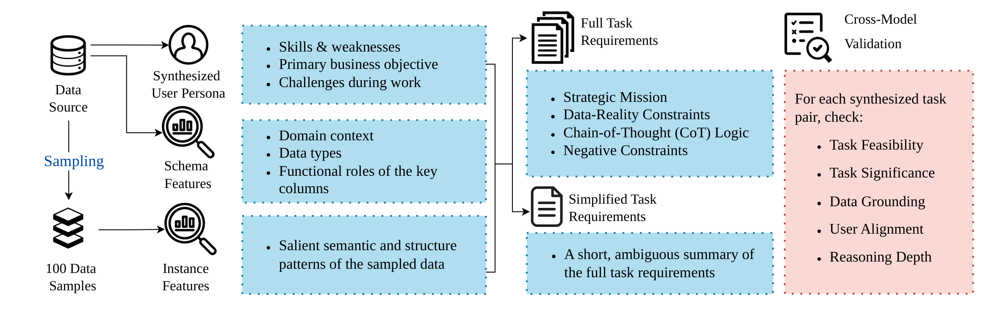
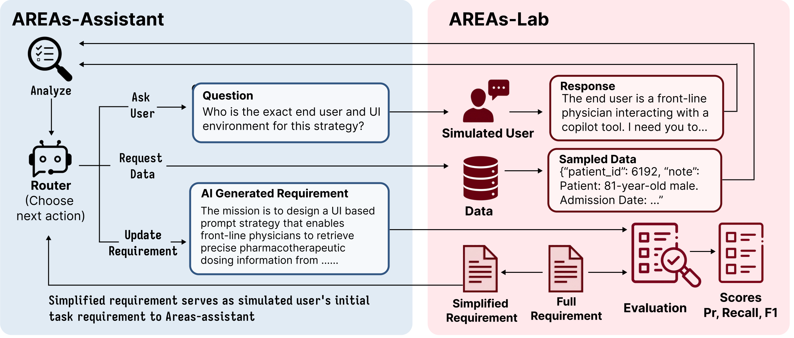

# AREAs-Lab: An Interactive Environment for AI-driven Requirement Elicitation for AI Systems

<p align="center">
  <a href="https://arxiv.org/abs/2608.28979">📄 Paper</a>&nbsp&nbsp | &nbsp&nbsp
  <a href="https://huggingface.co/datasets/ZihaoZhang/AREAs-Lab">🤗 Benchmark Data</a>&nbsp&nbsp | &nbsp&nbsp
  <!-- <a href="https://github.com/cpengshan/AREAs-Lab">💻 Code</a> -->
</p>

**AREAs-Lab** is an interactive environment for studying how an AI assistant turns a vague, underspecified task description into a complete, actionable requirement for an AI system. In AREAs-Lab, the **AREAs assistant** starts from an intentionally incomplete requirement, inspects the underlying dataset, asks targeted clarification questions, and iteratively refines the specification until it matches the user's latent intent.

The environment includes with:

- a **synthetic benchmark** of 151 requirement-elicitation tasks grounded in **16 public datasets** across **10 domains**, each with a user persona, a complete reference requirement, and an underspecified starting requirement;
- an **AI-simulated user** that holds the full requirement as hidden knowledge and discloses details only when asked the right question, in three collaboration styles (Passive / Normal / Active);
- an **automated evaluation pipeline** that decomposes requirements into atomic units and scores Precision / Recall / F1 against the reference;
- reference implementations of **five elicitation strategies** (No Interaction, Data Interaction, User Interaction (Fixed), User Interaction (Adaptive), Hybrid Interaction).

<!-- <p align="center">
  
</p> -->

## News


- `2026/10/03`: Code, benchmark data, and evaluation pipeline released in this repository.
- `2026/08/20`: 🎉 🎉 🎉 **AREAs-Lab has been accepted to EMNLP 2026 findings!**

## Benchmark Construction

The benchmark is grounded in 16 publicly available Hugging Face datasets spanning 10 domains. The datasets are not used as benchmark instances directly; instead, they serve as grounding material from which we synthesize user personas and task requirements. Each data source yields 5 synthesized user personas and 2 tasks per persona (Medium / High difficulty), giving 151 `(data source, user, task)` tuples after quality filtering.

<p align="center">
  
</p>

### Synthesis Pipeline

The data synthesis pipeline consists of four stages:


1. **Feature extraction.** Extract schema features from dataset metadata and semantic/structural patterns from 100 randomly sampled records per source.
2. **Persona synthesis.** Generate five personas per source with diverse expertise, business goals, and dataset-specific challenges.
3. **Task synthesis.** Generate two tasks per persona: **Medium** (interpretive reasoning) and **High** (complex or conflicting constraints). Each task includes a full requirement and a ~30-word informal summary.
4. **Quality control.** Combine manual audits with independent scoring by both validation models across six dimensions. Discard instances with an average score below 4/5 or any critical dimension below 3/5. Filtering retains 151 tasks; human assessment of 16 retained instances (one per source) yields a mean score of 4.67/5.

### Data Sources

| ID | Hugging Face Dataset | Domain | Description |
| ---: | --- | --- | --- |
| 1 | [`govreport-summarization`](https://huggingface.co/datasets/ccdv/govreport-summarization) | Legal | Government reports and long-form policy documents |
| 2 | [`pubmed-summarization`](https://huggingface.co/datasets/ccdv/pubmed-summarization) | Medical / Academic | Biomedical research articles and summaries |
| 3 | [`mediasum`](https://huggingface.co/datasets/ccdv/mediasum) | Media | Interview and media transcript summaries |
| 4 | [`arxiv-summarization`](https://huggingface.co/datasets/ccdv/arxiv-summarization) | Academic | Scientific papers from arXiv |
| 5 | [`patent-classification`](https://huggingface.co/datasets/ccdv/patent-classification) | Technical / Legal | Patent documents and classification labels |
| 6 | [`ECTSum`](https://huggingface.co/datasets/mrSoul7766/ECTSum) | Financial | Earnings call transcripts and summaries |
| 7 | [`esconv`](https://huggingface.co/datasets/thu-coai/esconv) | Psychological | Emotional support and counseling dialogues |
| 8 | [`multi_news`](https://huggingface.co/datasets/alexfabbri/multi_news) | Media | Multi-document news summaries |
| 9 | [`uk_legislation`](https://huggingface.co/datasets/santoshtyss/uk_legislation) | Legal | UK legislative and regulatory documents |
| 10 | [`fineweb-edu`](https://huggingface.co/datasets/HuggingFaceFW/fineweb-edu) | Educational | Educational and instructional web content |
| 11 | [`MATH-500`](https://huggingface.co/datasets/HuggingFaceH4/MATH-500) | Educational | Mathematical problem-solving tasks |
| 12 | [`danidanou/Reuters_Financial_News`](https://huggingface.co/datasets/danidanou/Reuters_Financial_News) | Financial | Global financial news articles and reports |
| 13 | [`eli5`](https://huggingface.co/datasets/Pavithree/eli5) | General / Educational | Explanations for complex questions (ELI5) |
| 14 | [`FiscalNote/billsum`](https://huggingface.co/datasets/FiscalNote/billsum) | Legal | Summaries of US Congressional and state bills |
| 15 | [`Harley-ml/lesswrong`](https://huggingface.co/datasets/Harley-ml/lesswrong) | Philosophy | Rationality and philosophy-focused forum posts |
| 16 | [`starmpcc/Asclepius-Synthetic-Clinical-Notes`](https://huggingface.co/datasets/starmpcc/Asclepius-Synthetic-Clinical-Notes) | Medical | Synthetic clinical notes and patient records |

## Task Definition

Each benchmark instance is an **information-asymmetry** episode:

1. The simulated user opens the conversation with the **simplified requirement** (a short, ambiguous summary of what they want).
2. The AREAs assistant takes actions until it is confident:
   - `ask_user(question)` — pose a clarification question to the simulated user;
   - `inspect_data(n_samples, split)` — sample rows from the task's dataset;
   - `finish(final_requirement)` — submit the reconstructed requirement.
3. The simulated user answers from four sources: the assistant's question, the user persona, the hidden **full requirement**, and the user's collaboration style. It never volunteers requirement details unless a relevant question is asked, and may express uncertainty or mild pushback on irrelevant questions.
4. The submitted requirement is compared against the full reference requirement.

<p align="center">
  
</p>

### Simulated User's Communication Styles

Communication style| Behavior |
--- | --- |
| **Passive** | Limited expression. Does not intentionally withhold information, but struggles to articulate details. |
| **Normal**  | Direct, clear, well-formed answers. Does not volunteer additional context. |
| **Active**  | Conversational and helpful. Proactively discloses relevant hidden details when appropriately triggered. |


## Quick Start

### Installation

Python 3.10+.

```bash
pip install -r requirements.txt
```

Create a `.env` file in the repo root with the API keys for the providers you use:

```
OPENAI_API_KEY=sk-...
GOOGLE_API_KEY=...
ANTHROPIC_API_KEY=sk-ant-...
```

The provider is inferred from the model-name prefix (`gpt-`/`o1`/`o3`/`o4` → OpenAI, `gemini-` → Google, `claude-` → Anthropic). To add a model, insert an entry in `PRICING_DATA` in [`AREAEnv/area_env/utils/llm.py`](AREAEnv/area_env/utils/llm.py).

### Data Setup

Download the [benchmark data](https://huggingface.co/datasets/ZihaoZhang/AREAs-Lab) from Hugging Face and place it under `AREAEnv/data/`. The directory layout mirrors the Hugging Face dataset ID:

```
AREAEnv/data/
├── data_synthesized/<hf_owner>/<dataset_name>/
│   ├── synthesized_output.json          # Personas + reference requirements (loaded by env)
│   ├── data_analysis.json
│   └── ground_truth_decompose.json      # Cached reference decompositions (optional)
└── data_sampled/<hf_owner>/<dataset_name>/
    └── data_sampled.json                # Instances served by inspect_data, split into
                                         # defining_instances / non_defining_instances
```


### Running the AREAs Assistant

Run [`agent/run_agent.py`](agent/run_agent.py) from the repo root. For example, **No Interaction** (zero-shot) on one task:

```bash
python agent/run_agent.py \
  --config AREAEnv/area_env/configs/default.yaml \
  --strategy zero_shot \
  --dataset ccdv/govreport-summarization \
  --task_id user_1_task_0 \
  --agent_model claude-sonnet-4-6
```

**Hybrid Interaction** with an active simulated user:

```bash
python agent/run_agent.py \
  --config AREAEnv/area_env/configs/default.yaml \
  --strategy hybrid \
  --dataset ccdv/govreport-summarization \
  --task_id user_1_task_0 \
  --agent_model claude-sonnet-4-6 \
  --communication_habit active \
  --max_iterations 3
```

| `--strategy` | Paper | Extra flags |
| --- | --- | --- |
| `zero_shot` | No Interaction | — |
| `data_interaction` | Data Interaction | `--split` |
| `user_interaction` | User Interaction (Adaptive) | `--communication_habit`, `--max_turns` |
| `hybrid` | Hybrid Interaction | `--communication_habit`, `--max_iterations` |

- `--task_id user_<N>_task_<k>` runs one task (`k` is 0 or 1); `--persona 1 2` runs all tasks of those personas; omit both to run the whole dataset.
- `--communication_habit passive | neutral | active` sets the simulated user's style (`neutral` = Normal).
- `--no_eval` skips the evaluator; `--exp_id <N>` resumes `Experiment<N>`.

## Citation

If you use AREAs-Lab, please cite:

```bibtex
@article{cai2026areas,
  title={AREAs-Lab: An Interactive Environment for AI-driven Requirement Elicitation for AI Systems},
  author={Cai, Pengshan and Zhang, Zihao and Jin, Ting and Zhu, Chenyang and Chawla, Kushal and Cho, Sangwoo and Novotney, Scott and Hu, Yebowen and Liu, Fei and Zhang, Shi-Xiong and others},
  journal={arXiv preprint arXiv:2608.28979},
  year={2026}
}
```
